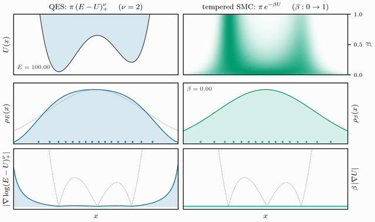

# QES — Quenched Ensemble Sampling

Evidence estimation by sequential Monte Carlo over a family of **soft** level
ensembles

```math
\rho_E(x) \propto \pi(x) (E - U(x))_+^{\nu}, \qquad U = -\log \mathcal{L},
```

with $`E`$ stepped downward. The level volume
$`G_\nu(E) = \mathrm{E}_\pi[(E-U)_+^\nu]`$ is measured along the ladder by
telescoped weight averages, and

```math
Z = \frac{1}{\Gamma(\nu+1)} \int G_\nu(E) e^{-E} \mathrm{d}E .
```

$`\nu`$ interpolates the two incumbents: $`\nu \to 0`$ is nested sampling's hard
constraint, whose score vanishes identically; $`\nu \to \infty`$ is tempering,
one effective temperature instead of a band. The interior is usable by a
gradient kernel and has no band of energies to skip.

The two paths on an asymmetric double well, both starting from the prior —
QES quenching a level to depth beside tempered SMC annealing $`\beta`$, with
each method's density and score:



## Install and run

```bash
uv sync --extra dev
```

```bash
uv run python examples/spike_slab.py --D 10 --seeds 3
```

```bash
uv run pytest -q
```

## Layout

```
qes/level.py     the family, the weights, the ESS dissection
qes/kernel.py    the inner MCMC kernels and the score metric
qes/adapt.py     step and metric adaptation
qes/qes.py       anchor, level loop, evidence estimator
qes/tempered.py  tempered SMC, matched in everything but the path
examples/        spike-slab, Gaussian, double well
```

Built on [blackjax](https://github.com/blackjax-devs/blackjax): the inner
kernel chosen as MALA (`mcmc.mala`), and resampling, ESS, and the schedule
bisection come from the SMC machinery. The kernel is preconditioned by a
diagonal metric read from the previous level's particle scores, and a single
scalar step size is held near the optimal acceptance rate by a constant-gain
controller.

---

© 2026 David Yallup. Released under the [Apache 2.0 license](LICENSE).
